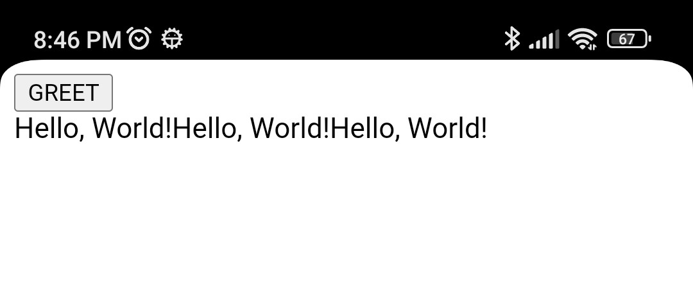

# Implement a Simple Calculator Android App by Reusing Logics in Rust via JavaScript-WASM Interfacing

As a followup of my previous work -- [Implement a Simple WASM Calculator in Rust Using Leptos, and with DumbCalculator](https://github.com/trevorwslee/wasm_calculator) --
this time, I would like to explore a *not-elegant-but-work-for-me* way to reuse the logics implemented in Rust, without the need to rewrite the core using Kotlin.

The idea is to use JavaScript as the bridge between the Android app and the WASM Rust code, which is 
largely realized with the help of `DumbCalculator` of [rusty_dumb_tools](https://crates.io/crates/rusty_dumb_tools).

* The binding of Rust (WASM) and JavaScript is done with the help of `wasm-bindgen` and `wasm-pack` --
https://github.com/rustwasm/wasm-bindgen/tree/main/examples/without-a-bundler
* For Android app to interact with JavaScript (web page), Android's `WebView` is the key enabler


## Starting the Project

Since it will be an Android App -- `ACalculatorApp` -- naturally, we will create an ***Android Studio*** project for it.
Nevertheless, inside the project, we will be creating a little Rust project for developing the JavaScript bridge.

Simply, create an ***Android Studio*** project `ACalculatorApp`


## Initialize for the JavaScript-Rust Bridge

To start coding for the JavaScript-Rust bridge:

* Open the created folder `ACalculatorApp` with ***VSCode***


* Create the folder `rust` (inside `ACalculatorApp`)

* In the folder `rust`
  - Create `Cargo.toml`
```
[package]
name = "dumb_calculator"
version = "0.1.0"
edition = "2021"
[lib]
crate-type = ["cdylib"]
[dependencies]
wasm-bindgen = "0.2.92"
rusty_dumb_tools = "0.1.11"
[dependencies.web-sys]
version = "0.3.4"
features = [
  'Document',
  'Element',
  'HtmlElement',
  'Node',
  'Window',
]
```
    Note that in order for `wasm-bindgen` to work, need the followings
    * `crate-type = ["cdylib"]`
    * `[dependencies.web-sys]`
    * `wasm-bindgen = "0.2.92"`

  - Create `src/lib.rc`
```
use wasm_bindgen::prelude::*;
#[wasm_bindgen]
pub fn get_greeting(who: String) -> String {
    format!("Hello, {}!", who)
}
```

  - Create `simple.html`
```
<script type="module">
  import init, { get_greeting } from './pkg/dumb_calculator.js';
  async function load() {
      await init();
      window.get_greeting = get_greeting;
  }
  load();
</script>
<button onclick="document.getElementById('msg').innerText+=get_greeting('World')">GREET</button>
<div id="msg"></div>
```  

* Try build the Rust code

  Open a terminal to `rust` and run
  ```
  wasm-pack build --target web
  ```
  This will create `target` and `pkg`

* Start ***Live Server*** VSCode extension
  - visit localhost:5501/rust/simple.html
  - click the `GREET` button

  
  
* An alternative is to use Python's `http.server`
  ```
  python -m http.server
  ```
  - visit localhost:8000//simple.html

## Key Takeaways of the JavaScript-WASM Bridge

* Rust functions are exposed simply by annotating them like
```
use wasm_bindgen::prelude::*;
#[wasm_bindgen]
pub fn get_greeting(who: String) -> String {
  ...
}
```
* `Cargo.toml` requires some special specifications 
  - `crate-type = ["cdylib"]`
  - `[dependencies.web-sys]`
  - `wasm-bindgen = "0.2.92"`
* Building not with `cargo`, but with `wasm-pack` like
```
wasm-pack build --target web
```  
* HTML page loads the WASM Rust exposed requires a "module" like
```
<script type="module">
  import init, { get_greeting } from './pkg/dumb_calculator.js';
  async function load() {
      await init();
      window.get_greeting = get_greeting;
  }
  load();
</script>
```
Notice:
* the `load()` async function, which calls `init` generated
* `load()` invoked explicitly as the last thing of the *module*
* after *load*, assign the exposed -- `get_greeting` in this case -- to `window` so that it can be accessed outside of the "module"


## Android Calling the JavaScript-WASM "Bridge"

The key enabled is an Android `WebView`. With Jetpack Compose, it can be programmed like

```
val ENDPOINT: String = "http://192.168.0.17:8000/simple.html"
class MainActivity : ComponentActivity() {
    override fun onCreate(savedInstanceState: Bundle?) {
        super.onCreate(savedInstanceState)
        setContent {
            SimpleBridgeWebView()
        }
    }
}
@Composable
fun SimpleBridgeWebView(modifier: Modifier = Modifier) {
    AndroidView(
        factory = { context ->
            WebView(context).apply {
                this.layoutParams = ViewGroup.LayoutParams(
                    ViewGroup.LayoutParams.MATCH_PARENT,
                    ViewGroup.LayoutParams.MATCH_PARENT
                )
                this.settings.javaScriptEnabled = true
                this.webViewClient = WebViewClient()
                this.loadUrl(ENDPOINT)
            }
        },
        update = {}
    )
}
```

***Important notes***:

- Android permission settings in `AndroidManifest.xml`:
  * allow access to the Internet:
    ```
    <manifest ...>
      <uses-permission android:name="android.permission.INTERNET" />
    ```
  * allow `WebView` "clear text" traffic  
    ```
    <application ...
      android:usesCleartextTraffic="true"
    ```  

- you should change the IP and port in `ENDPOINT` to yours

- you may get into "firewall" issue; if so, be suggested to try to use Python's `http.server` to serve the "bridge"
  since very likely, your Python installation likely already has firewall access setup 

Run the Android app, and see that the "bridge" loads and is working




## Package the "Bridge" with the App

It is possible to package the "bridge" in the app PKG. To do so, we will need to put everything of the "bridge" to the `assets` folder like

|Android Studio|VSCode|
|--|--|
|||

To copy the "bridge" over to `assets`, after building it by running
```
wasm-pack build --target web
```
additionally run
```
mkdir ../app/src/main/assets
mkdir ../app/src/main/assets/bridge
cp bridge.html simple.html ../app/src/main/assets/bridge/
cp -r pkg ../app/src/main/assets/bridge/pkg
```

In order to make things easier, create a `rust/build.sh` like
```
set -ex
wasm-pack build --target web
cp *.html ../app/src/main/assets/bridge/
cp -r pkg ../app/src/main/assets/bridge/pkg
```

Now, every time want to build the "bridge", in `rust` run `build.sh` 


Steps:

* create android studio project
* try build and run the app
* create repository
* open project folder with VSCode
* add folder `rust`
* add `rust\Cargo.toml`
* add folder `rust\src\lib`
* add rust `rust\index.html`
* add `rust\build.sh`
* after running `build.sh` will product content in
  - `rust\target` -- cargo build result
  - `rust\pkg` -- WASM output
* start ***Live Server*** VSCode extension
  - visit localhost:5501/rust/simple.html
  - navigate to `rust` folder
  - click the `call WASM` button
* or use Python's `http.server`
  - visit localhost:8000/simple.html


Android side:
* ensure folder `app/src/main/assets/bridge`
* permissions:
  - access Internet:
    ```
    <uses-permission android:name="android.permission.INTERNET" />
    ```
  - `WebView` allow *clear text" traffic  
    ```
    android:usesCleartextTraffic="true"
    ```  
* If use real phone, assume it connects to your local network
* add `MainView`
  - for `WebViewAssetLoader` will need to include some additional .. just let Android Studio include it


Trying app out:
* Suggest to use Python's `http.server`, or else might get into *firewall issue*
* Need to find out the IP of this development machine
  - set `REMOTE_URL` in `MainActivity.kt`  according to your development machine's IP
* Deploy the app  


Others
* Preview
* Fix Orientation
* 