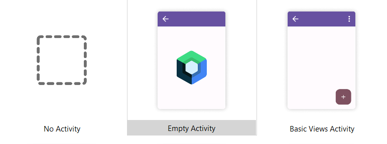
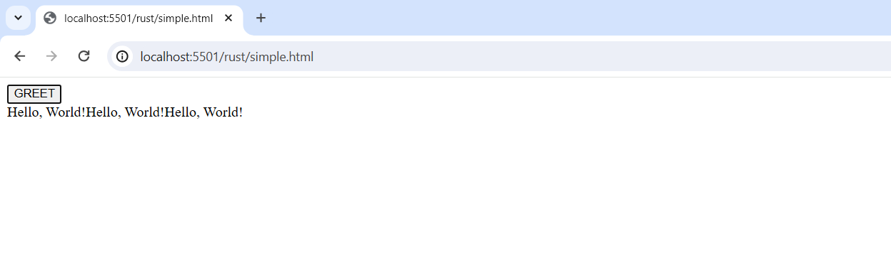

# Implement a Simple Calculator Android App by Reusing Logics in Rust via JavaScript-WASM Interfacing

As a followup of my previous work -- [Implement a Simple WASM Calculator in Rust Using Leptos, and with DumbCalculator](https://github.com/trevorwslee/wasm_calculator) --
this time, I would like to explore a *not-elegant-but-work-for-me* way to reuse the logics implemented in Rust, without going through the trouble rewriting the core using Kotlin.

The idea is to use JavaScript as the bridge between the Android app and the WASM Rust code, which is 
largely realized with the help of `DumbCalculator` of [rusty_dumb_tools](https://crates.io/crates/rusty_dumb_tools).

* The binding of Rust (WASM) and JavaScript is realized with the help of `wasm-bindgen` and `wasm-pack` --
https://github.com/rustwasm/wasm-bindgen/tree/main/examples/without-a-bundler
* You can refer to [`wasm-pack` Quickstart](https://rustwasm.github.io/docs/wasm-pack/quickstart.html) for instruction on installing `wasm-pack`
* For Android app to interact with JavaScript (web page), Android's `WebView` is the key enabler
* You can refer to [Install Android Studio](https://developer.android.com/studio/install) for instruction on installing ***Android Studio***
* Other than ***Android Studio***, [VSCode](https://code.visualstudio.com/download) is used for developing the Rust code

## Starting the Project

Since it will be an Android App -- `ACalculatorApp` -- naturally, we will create an ***Android Studio*** project for it.
Moreover, inside the project, we will be creating a little Rust project for developing the JavaScript bridge.

Simply, create an ***Android Studio*** project `ACalculatorApp`





## Initialize for the JavaScript-Rust "Bridge"

To start coding for the JavaScript-Rust "bridge":

* Open the created folder `ACalculatorApp` with ***VSCode***


* Create the folder `rust` (inside `ACalculatorApp`)

* In the folder `rust`, create `Cargo.toml`
    ```
    [package]
    name = "dumb_calculator"
    version = "0.1.0"
    edition = "2021"
    [lib]
    crate-type = ["cdylib"]
    [dependencies]
    wasm-bindgen = "0.2.92"
    rusty_dumb_tools = "0.1.11"
    [dependencies.web-sys]
    version = "0.3.4"
    features = [
    'Document',
    'Element',
    'HtmlElement',
    'Node',
    'Window',
    ]
    ``` 
    Note that in order for `wasm-bindgen` to work, the following configurations are required
    - `crate-type = ["cdylib"]`
    - `[dependencies.web-sys]`
    - `wasm-bindgen = "0.2.92"`

* In the folder `rust`, create `src/lib.rc`
```
use wasm_bindgen::prelude::*;
#[wasm_bindgen]
pub fn get_greeting(who: String) -> String {
    format!("Hello, {}!", who)
}
```

* In the folder `rust`, create `simple.html`
```
<script type="module">
  import init, { get_greeting } from './pkg/dumb_calculator.js';
  async function load() {
      await init();
      window.get_greeting = get_greeting;
  }
  load();
</script>
<button onclick="document.getElementById('msg').innerText+=get_greeting('World')">GREET</button>
<div id="msg"></div>
```  

* Try build the Rust code

  Open a terminal to `rust` and run
  ```
  wasm-pack build --target web
  ```
  This will generate the output folders `target` and `pkg`

* Start ***Live Server*** VSCode extension
  - visit localhost:5501/rust/simple.html
  - click the `GREET` button

  
  
* An alternative is to use Python's `http.server`; in `rust`, open a terminal and run
  ```
  python -m http.server
  ```
  - visit localhost:8000/simple.html

## Key Takeaways of the JavaScript-WASM Bridge

* Rust functions are exposed simply by annotating them like
```
use wasm_bindgen::prelude::*;
#[wasm_bindgen]
pub fn get_greeting(who: String) -> String {
  ...
}
```
* `Cargo.toml` requires some special specifications 
  - `crate-type = ["cdylib"]`
  - `[dependencies.web-sys]`
  - `wasm-bindgen = "0.2.92"`
* Building not with `cargo`, but with `wasm-pack` like
```
wasm-pack build --target web
```  
* HTML page that loads the WASM Rust exposed needs be in "module" like
```
<script type="module">
  import init, { get_greeting } from './pkg/dumb_calculator.js';
  async function load() {
      await init();
      window.get_greeting = get_greeting;
  }
  load();
</script>
```
Notice:
* the `load()` async function, which calls `init` generated
* `load()` invoked explicitly as the last thing of the *module*
* after *load*, assign the exposed -- `get_greeting` in this case -- to `window` so that it can be accessed outside of the "module"


## Android Calling the JavaScript-WASM "Bridge"

The key enabled is an Android `WebView`. With Jetpack Compose, it can be programmed like

(*as in `simple` package*)
```
val ENDPOINT: String = "http://192.168.0.17:8000/simple.html"
class MainActivity : ComponentActivity() {
    override fun onCreate(savedInstanceState: Bundle?) {
        super.onCreate(savedInstanceState)
        setContent {
            SimpleBridgeWebView()
        }
    }
}
@Composable
fun SimpleBridgeWebView(modifier: Modifier = Modifier) {
    AndroidView(
        factory = { context ->
            WebView(context).apply {
                this.settings.javaScriptEnabled = true
                this.webViewClient = WebViewClient()
                this.loadUrl(ENDPOINT)
            }
        },
        update = {}
    )
}
```
Notice:
- `WebView` is wrapped with an `AndroidView`
- `javaScriptEnabled`, but currently no JavaScript is involved
- `loadUrl` is called to load the "bridge" (web page) when the `WebView` is created


***Important*** Notes:
- you should change the IP and port in `ENDPOINT` to yours
- you may get into "firewall" issue; if so, be suggested to try to use Python's `http.server` to serve the "bridge"
  since very likely your Python installation already has firewall access setup 


More ***importantly***, modify Android permission settings in `AndroidManifest.xml`:
* allow access to the Internet:
```
<manifest ...>
    <uses-permission android:name="android.permission.INTERNET" />
```
* allow `WebView` "clear text" traffic  
```
<application ...
    android:usesCleartextTraffic="true"
```  

 Reminder: this repository already includes the above code in the `simple` package, you can use that `MainActivity` simply by changing `AndroidManifest.xml` like
 ```
    ...
    <activity
        android:name=".simple.MainActivity"
        ...
```   


Build and run the Android app, and see that the "bridge" loads and is working


## Package the "Bridge" with the App

It is possible to package the "bridge" in the app's PKG. To do so, we will need to put everything of the "bridge" to the `assets` folder like

|Android Studio|VSCode|
|--|--|
|||

To copy the "bridge" over to `assets`, after building it by running
```
wasm-pack build --target web
```
additionally run
```
mkdir ../app/src/main/assets
mkdir ../app/src/main/assets/bridge
cp bridge.html simple.html ../app/src/main/assets/bridge/
cp -r pkg ../app/src/main/assets/bridge/pkg
```

In order to make things easier, create a `rust/build.sh` like
```
set -ex
wasm-pack build --target web
cp *.html ../app/src/main/assets/bridge/
cp -r pkg ../app/src/main/assets/bridge/pkg
```

Now, every time want to build the "bridge", in `rust` run `build.sh` 

As for the Android app side, somethings need be changed
(*as in `internal` package*)
```
class MainActivity : ComponentActivity() {
    override fun onCreate(savedInstanceState: Bundle?) {
        super.onCreate(savedInstanceState)
        setContent {
            SimpleInternBridgeWebView()
        }
    }
}
@Composable
fun SimpleInternBridgeWebView(modifier: Modifier = Modifier) {
    AndroidView(
        factory = { context ->
            val assetLoader = WebViewAssetLoader.Builder()
                .addPathHandler("/assets/", WebViewAssetLoader.AssetsPathHandler(context))
                .build()
            WebView(context).apply {
                this.settings.javaScriptEnabled = true
                this.webViewClient = object : WebViewClient() {
                    override fun shouldInterceptRequest(
                        view: WebView,
                        request: WebResourceRequest
                    ): WebResourceResponse? {
                        return assetLoader.shouldInterceptRequest(request.url)
                    }
                }
                this.loadUrl("https://appassets.androidplatform.net/assets/bridge/simple.html")
            }
        },
        update = {}
    )
}
```
Notes:
- `assetLoader` is used to act as a web server that serves web contents from `assets`
- `shouldInterceptRequest` is intercepted to call `assetLoader`
- the URL is now like `https://appassets.androidplatform.net/assets/bridge/simple.html`

Again, build and run the Android app, and see that the "bridge" loads from `assets` and is working


## Add Some Jetpack Compose Code to Call `get_greeting`

The first thing to realize is that we need to get hold of the `WebView` in order to be able to call its special tailored methods

To achieve this, we need to refactor the code a bit so that the `WebView` is created explicitly outside of `SimpleInternBridgeWebView` like
```
...
    setContent {
        val webView = createSimpleInternBridgeWebView(this)
        SimpleInternBridgeWebView(webView)
    }
...
```

With the `WebView` (`webView`), we call its `evaluateJavascript` method to invoke the "bridge" asynchronously like
```
    webView.evaluateJavascript("get_greeting('Android')") {
        greeting.value = it
    }
```

And here is the code
(*as in `internal_ui` package*)
```
class MainActivity : ComponentActivity() {
    override fun onCreate(savedInstanceState: Bundle?) {
        super.onCreate(savedInstanceState)
        setContent {
            val webView = createSimpleInternBridgeWebView(this)
            Column() {
                val greeting = remember { mutableStateOf("...") }
                SimpleInternBridgeWebView(webView)
                Text(text = greeting.value)
                Button(onClick = {
                    webView.evaluateJavascript("get_greeting('Android')") {
                        greeting.value = it
                    }
                }) {
                    Text("Get Greeting")
                }
            }
        }
    }
}
@Composable
fun SimpleInternBridgeWebView(webView: WebView, modifier: Modifier = Modifier) {
    AndroidView(
        factory = { context -> webView },
        update = { webView.loadUrl("https://appassets.androidplatform.net/assets/bridge/simple.html") }
    )
}
fun createSimpleInternBridgeWebView(context: Context): WebView {
    val assetLoader = WebViewAssetLoader.Builder()
        .addPathHandler("/assets/", WebViewAssetLoader.AssetsPathHandler(context))
        .build()
    return WebView(context).apply {
        this.settings.javaScriptEnabled = true
        this.webViewClient = object : WebViewClient() {
            override fun shouldInterceptRequest(
                view: WebView,
                request: WebResourceRequest
            ): WebResourceResponse? {
                return assetLoader.shouldInterceptRequest(request.url)
            }
        }
        this.loadUrl("https://appassets.androidplatform.net/assets/bridge/simple.html")
    }
}
```


## Lets Bring Some Calculator Code into the Picture

As mentioned previously, the Android App will be a simple calculator with core implementation in Rust with the help of `DumbCalculator`. Now, lets bring `DumbCalculator` into the picture and make change to the code `lib.rs`

```
use wasm_bindgen::prelude::*;
use std::{cell::RefCell, mem::{self, MaybeUninit}, sync::Once};
use rusty_dumb_tools::calculator::DumbCalculator;

#[wasm_bindgen]
pub fn get_greeting(who: String) -> String {
    format!("Hello, {}!", who)
}

#[wasm_bindgen]
struct Calculator {
    display_width: usize,
    calculator: DumbCalculator,
}
#[wasm_bindgen]
impl Calculator {
    pub fn new(display_width: u8) -> Calculator {
        Calculator {
            display_width: display_width as usize,
            calculator: DumbCalculator::new(),
        }
    }
    pub fn push(&mut self, key: &str) {
        self.calculator.push(key).unwrap();
    }
    pub fn get_display(&self) -> String {
        self.calculator.get_display_sized(self.display_width)
    }
}
```
Notice:
- Now, we have a `Calculator` class to expose
- Again, in order to expose, simply annotate the `struct` as well as the `impl` with `#[wasm_bindgen]`

And we use another "bridge" -- `simple_calculator.html`
```
<script type="module">
  import init, { Calculator } from './pkg/dumb_calculator.js';
  async function load() {
      await init();
      window.Calculator = Calculator;
  }
  load();
</script>
<script>
  function new_calc() {
    calc = Calculator.new(5);
    _sync_calc();
  }
  function _sync_calc() {
    let display = calc.get_display();
    let elem = document.getElementById('msg');
    elem.innerText = display;
  }
</script>
<div id="buttons">
  <button onclick="new_calc()">new</button>
  <button onclick="calc.push('1'); _sync_calc();">1</button>
  <button onclick="calc.push('+'); _sync_calc();">+</button>
  <button onclick="calc.push('2'); _sync_calc();">2</button>
  <button onclick="calc.push('='); _sync_calc();">=</button>
</div>
<div id="msg"></div>
```
Notice that in another `<script>` block, some JavaScript functions are defined
- `new_calc()` should be called to crate a new `Calculator` instance, and assign it to the JavaScript variable `calc`
- after creating a new `Calculator` instance with `new_calc()`, can call the methods of `Calculator` like `calc.push('1')`
- `_sync_calc()` is there to synchronize the `Calcuator`'s *display* with the "msg" `<div>`


Try it! Simply change the above `simple.html` to `simple_calculator.html`, like in `ENDPOINT`
```
val ENDPOINT: String = "http://192.168.0.17:8000/simple_calculator.html"
```


## It Appears that It Will Work!

Nevertheless:

* The Rust code file `lib.rs` need be extended in order to expose more functionalities of `DumbCalculator`
* The "bridge" is also extended, like in `bridge.html`
* The complete `ACalculatorApp` coding is quite involving, mostly due to UI coding


|  |  |
|--|--|
|**Without going into all the details of the implementation, I hope this exploration at this point is already enjoyable.**||

## Enjoy!

You are more than welcome to clone the [GitHub repository](https://github.com/trevorwslee/ACalculatorApp) and build and run the complete Android app yourself.


> Peace be with you!
> May God bless you!
> Jesus loves you!
> Amazing grace!

